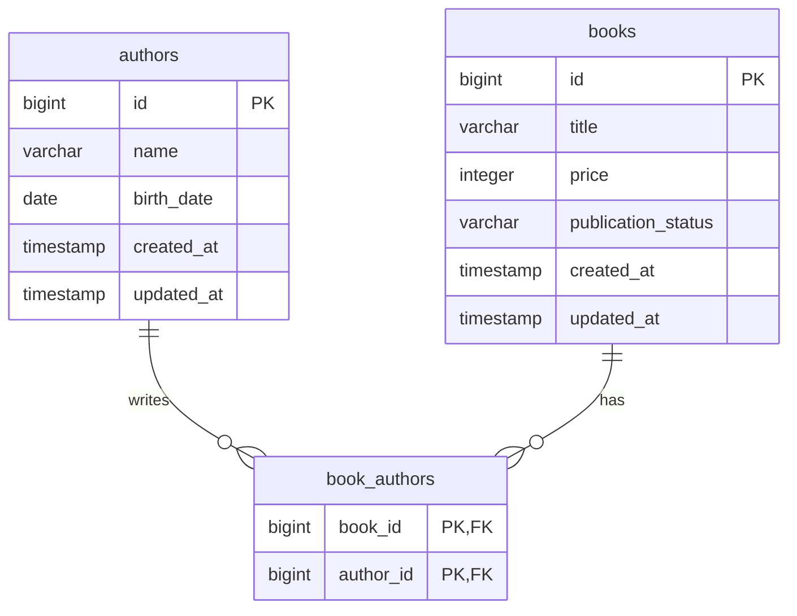

# Design

## Scope

LibrarySystemAPI は、書籍と著者を管理するバックエンド API です。

このドキュメントでは、まずデータベースのテーブル設計を定義します。API 設計、エラー設計、テスト方針は後続で追記します。

## Table Design

### Overview

書籍と著者は多対多の関係です。

1 冊の書籍には 1 人以上の著者が紐づきます。1 人の著者は複数の書籍を執筆できます。



### authors

著者を表すテーブルです。

| Column | Type | Nullable | Description |
| --- | --- | --- | --- |
| id | bigint | no | 著者 ID |
| name | varchar(255) | no | 著者名 |
| birth_date | date | no | 生年月日 |
| created_at | timestamp | no | 作成日時 |
| updated_at | timestamp | no | 更新日時 |

#### Constraints

| Name | Definition | Reason |
| --- | --- | --- |
| pk_authors | primary key (`id`) | 著者を一意に識別するため |
| chk_authors_birth_date | `birth_date <= current_date` | 生年月日は現在日以前である必要があるため |

### books

書籍を表すテーブルです。

| Column | Type | Nullable | Description |
| --- | --- | --- | --- |
| id | bigint | no | 書籍 ID |
| title | varchar(255) | no | タイトル |
| price | integer | no | 価格 |
| publication_status | varchar(20) | no | 出版状況 |
| created_at | timestamp | no | 作成日時 |
| updated_at | timestamp | no | 更新日時 |

#### publication_status

| Value | Description |
| --- | --- |
| UNPUBLISHED | 未出版 |
| PUBLISHED | 出版済み |

#### Constraints

| Name | Definition | Reason |
| --- | --- | --- |
| pk_books | primary key (`id`) | 書籍を一意に識別するため |
| chk_books_price | `price >= 0` | 価格は 0 以上である必要があるため |
| chk_books_publication_status | `publication_status in ('UNPUBLISHED', 'PUBLISHED')` | 出版状況を定義済みの値に限定するため |

### book_authors

書籍と著者の関連を表す中間テーブルです。

| Column | Type | Nullable | Description |
| --- | --- | --- | --- |
| book_id | bigint | no | 書籍 ID |
| author_id | bigint | no | 著者 ID |

#### Constraints

| Name | Definition | Reason |
| --- | --- | --- |
| pk_book_authors | primary key (`book_id`, `author_id`) | 同じ書籍と著者の組み合わせを重複させないため |
| fk_book_authors_book_id | foreign key (`book_id`) references `books` (`id`) | 存在する書籍だけを紐づけるため |
| fk_book_authors_author_id | foreign key (`author_id`) references `authors` (`id`) | 存在する著者だけを紐づけるため |

## Business Rules

DB 制約だけでは表現しづらい仕様は、アプリケーション層で検証します。

| Rule | Validation Layer | Reason |
| --- | --- | --- |
| 書籍には最低 1 人の著者が必要 | application | 中間テーブルだけでは、書籍作成時点で著者 0 人を禁止しづらいため |
| 書籍には複数の著者を指定できる | database / application | `book_authors` で多対多を表現し、リクエストでも複数 ID を受け取るため |
| 出版済みの書籍は未出版に戻せない | application | 更新前後の状態比較が必要なため |
| 著者 ID は存在する必要がある | database / application | FK で保証しつつ、API では分かりやすいエラーを返すため |

## Indexes

初期実装では、主キーと外部キーに必要なインデックスを中心にします。

| Table | Index | Columns | Reason |
| --- | --- | --- | --- |
| authors | pk_authors | id | 著者の取得・更新 |
| books | pk_books | id | 書籍の取得・更新 |
| book_authors | pk_book_authors | book_id, author_id | 書籍に紐づく著者の重複防止 |
| book_authors | idx_book_authors_author_id | author_id | 著者に紐づく書籍一覧取得 |

## API Design

API は以下の 3 種類に分類します。

| Category | Purpose | Endpoints |
| --- | --- | --- |
| 登録系 | 著者・書籍を新規登録する | `POST /authors`, `POST /books` |
| 更新系 | 著者・書籍を更新する | `PUT /authors/{authorId}`, `PUT /books/{bookId}` |
| 参照系 | 著者に紐づく書籍を取得する | `GET /authors/{authorId}/books` |

### Common Policy

- Request / response body は JSON とします。
- ID は path parameter で受け取ります。
- 日付は ISO-8601 形式の `yyyy-MM-dd` で扱います。
- 更新 API はリソース全体の更新として扱い、HTTP method は `PUT` を使います。
- API response の enum 値は DB と同じく `UNPUBLISHED`, `PUBLISHED` を返します。

### Create Author

著者を登録します。

```http
POST /authors
```

#### Request

```json
{
  "name": "夏目漱石",
  "birthDate": "1867-02-09"
}
```

#### Response

```http
201 Created
```

```json
{
  "id": 1,
  "name": "夏目漱石",
  "birthDate": "1867-02-09"
}
```

#### Validation

| Field | Rule |
| --- | --- |
| name | 必須 |
| birthDate | 必須、現在日以前 |

### Update Author

著者を更新します。

```http
PUT /authors/{authorId}
```

#### Request

```json
{
  "name": "夏目 金之助",
  "birthDate": "1867-02-09"
}
```

#### Response

```http
200 OK
```

```json
{
  "id": 1,
  "name": "夏目 金之助",
  "birthDate": "1867-02-09"
}
```

#### Validation

| Field | Rule |
| --- | --- |
| authorId | 存在する著者 ID |
| name | 必須 |
| birthDate | 必須、現在日以前 |

### Create Book

書籍を登録します。

```http
POST /books
```

#### Request

```json
{
  "title": "吾輩は猫である",
  "price": 1200,
  "authorIds": [1],
  "publicationStatus": "UNPUBLISHED"
}
```

#### Response

```http
201 Created
```

```json
{
  "id": 1,
  "title": "吾輩は猫である",
  "price": 1200,
  "publicationStatus": "UNPUBLISHED",
  "authors": [
    {
      "id": 1,
      "name": "夏目漱石",
      "birthDate": "1867-02-09"
    }
  ]
}
```

#### Validation

| Field | Rule |
| --- | --- |
| title | 必須 |
| price | 必須、0 以上 |
| authorIds | 必須、1 件以上、すべて存在する著者 ID |
| publicationStatus | 必須、`UNPUBLISHED` または `PUBLISHED` |

### Update Book

書籍を更新します。

```http
PUT /books/{bookId}
```

#### Request

```json
{
  "title": "吾輩は猫である",
  "price": 1300,
  "authorIds": [1],
  "publicationStatus": "PUBLISHED"
}
```

#### Response

```http
200 OK
```

```json
{
  "id": 1,
  "title": "吾輩は猫である",
  "price": 1300,
  "publicationStatus": "PUBLISHED",
  "authors": [
    {
      "id": 1,
      "name": "夏目漱石",
      "birthDate": "1867-02-09"
    }
  ]
}
```

#### Validation

| Field | Rule |
| --- | --- |
| bookId | 存在する書籍 ID |
| title | 必須 |
| price | 必須、0 以上 |
| authorIds | 必須、1 件以上、すべて存在する著者 ID |
| publicationStatus | 必須、`UNPUBLISHED` または `PUBLISHED` |

#### Business Rule

`publicationStatus` は `UNPUBLISHED` から `PUBLISHED` へ変更できます。

一度 `PUBLISHED` になった書籍を `UNPUBLISHED` に戻すことはできません。

### Get Books By Author

著者に紐づく書籍一覧を取得します。

```http
GET /authors/{authorId}/books
```

#### Response

```http
200 OK
```

```json
{
  "author": {
    "id": 1,
    "name": "夏目漱石",
    "birthDate": "1867-02-09"
  },
  "books": [
    {
      "id": 1,
      "title": "吾輩は猫である",
      "price": 1200,
      "publicationStatus": "UNPUBLISHED"
    }
  ]
}
```

#### Validation

| Field | Rule |
| --- | --- |
| authorId | 存在する著者 ID |

## Notes

- ID は PostgreSQL の identity column を使います。
- `created_at` と `updated_at` は API レスポンスには必須ではありませんが、データ管理のためテーブルには持たせます。
- `updated_at` はアプリケーション層で更新します。
- 論理削除は課題仕様にないため採用しません。
